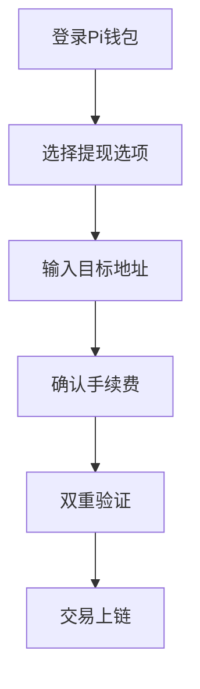

# Pi钱包提现指南：何时能真正提现？

## Pi网络的核心概念

Pi网络作为创新性移动挖矿项目，正吸引全球数千万用户参与。该项目通过智能手机即可挖矿Pi币的模式，为普通人参与区块链经济提供了新途径。但关于钱包提现功能的疑问，我们需要从网络发展阶段说起。

### 三大核心发展阶段解析

| 阶段        | 主要特征                | 钱包功能限制          |
|-------------|-------------------------|-----------------------|
| 测试网阶段  | 系统测试/用户学习       | 仅限测试币流通        |
| 主网上线    | 区块链正式运行          | 开放真实币提现        |
| 生态成熟期  | 商业应用全面落地        | 多场景支付/转账功能   |

**测试网阶段特别提醒**：当前用户持有的测试币不具备真实价值，所有交易仅用于系统测试。这个阶段的主要目的是让用户熟悉钱包操作流程，为正式上线做准备。

👉 [立即了解Pi网络最新进展](https://bit.ly/okx_welcome)

## 当前提现能力分析

### 测试网阶段的现实约束
- 测试币流通范围：仅限Pi浏览器App内部使用
- 功能测试重点：账户安全验证、交易界面优化等
- 系统压力测试：模拟百万级用户同时操作场景

### 主网上线倒计时
开发团队已明确表示，真实Pi币的流通需待主网上线后实现。这个阶段将带来：
1. 基于区块链的真实价值转移
2. 与第三方交易平台的对接
3. 跨钱包转账功能开放

## 提现准备完全指南

### 钱包设置三步法
1. **应用安装**：通过官方渠道下载Pi浏览器App
2. **账户创建**：生成12字助记词并完成密钥备份
3. **安全强化**：启用指纹/面部识别+双重验证

### KYC验证全流程
1. **信息提交**：护照/身份证扫描件+面部识别
2. **审核周期**：7-15个工作日（按邀请批次处理）
3. **验证状态**：在钱包账户页实时查看进度

👉 [安全存储数字资产技巧](https://bit.ly/okx_welcome)

## 主网上线后的提现流程

### 标准操作步骤

### 常见问题解答
**Q：提现是否收取手续费？**  
A：初期采用动态手续费机制，具体费率将根据网络拥堵情况实时调整。

**Q：提现到交易所需要多长时间？**  
A：目标实现10分钟内完成上链确认，实际到账时间可能受交易所处理速度影响。

**Q：最小提现金额是多少？**  
A：预计设置100 Pi的门槛，防止小额交易造成网络拥堵。

## 资产安全防护体系

### 五层防护策略
1. **密钥管理**：建议采用硬件钱包存储助记词
2. **设备安全**：仅在常用设备登录账户
3. **网络环境**：避免使用公共WiFi进行敏感操作
4. **交易确认**：仔细核对收款地址的每个字符
5. **异常监控**：开启账户变动通知功能

### 风险应对方案
- 账户异常：立即通过App内"冻结账户"功能暂停所有操作
- 密钥遗失：联系客服启动账户恢复流程（需通过KYC验证）
- 钓鱼防范：所有系统通知均通过App内消息中心发送

## 未来发展趋势

随着主网上线临近，预计将实现：
- 跨链桥接技术应用
- 去中心化交易所接入
- 商户支付解决方案
- 稳定币发行机制

👉 [探索更多区块链应用场景](https://bit.ly/okx_welcome)

## 关键行动清单

1. ✅ 完成Pi浏览器App安装与钱包创建
2. ✅ 妥善保管12字助记词（建议纸质备份+保险箱存储）
3. ✅ 关注官方渠道获取KYC邀请通知
4. ✅ 熟悉钱包操作界面（测试网期间多加练习）
5. ✅ 学习区块链安全知识（推荐官方教育专栏）

当前阶段虽不能进行真实Pi币提现，但通过充分准备可以确保在主网上线后第一时间安全操作。建议用户持续关注官方公告，及时获取最新动态和操作指南。随着网络生态的完善，Pi币的应用场景将不断扩大，提前做好技术准备将帮助您更好地把握未来机遇。
