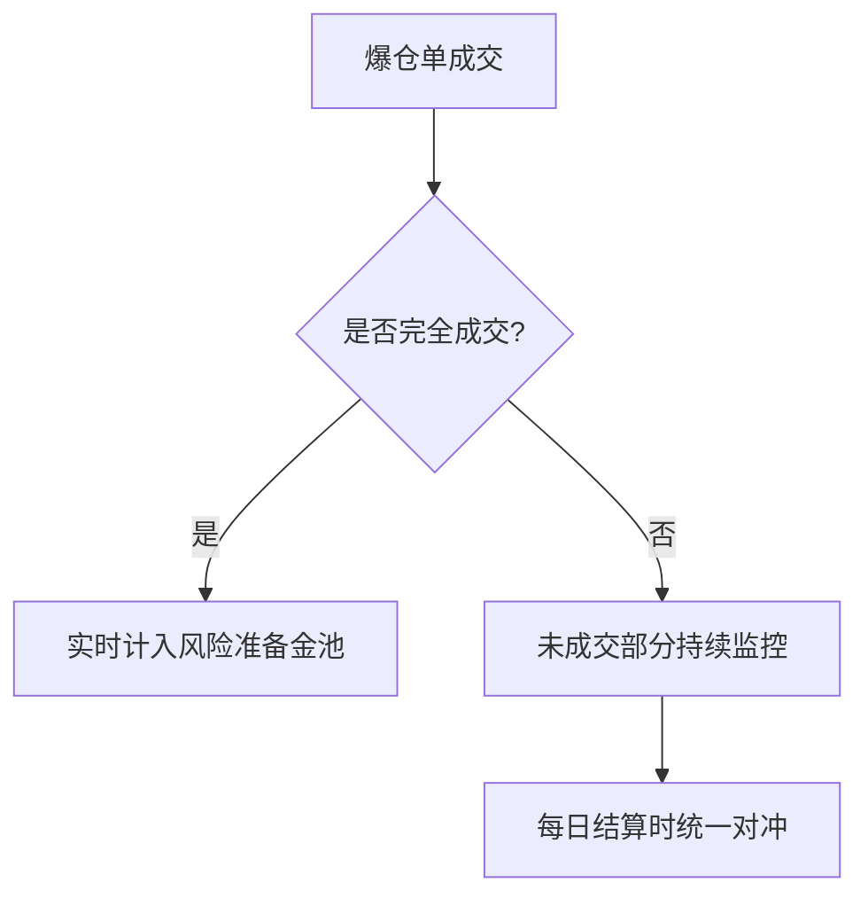

# 爆仓单委托处理方式解析

## 一、核心概念解析
在合约交易风险管理中，理解以下专业术语至关重要：

| 术语          | 定义说明                                                                 |
|---------------|--------------------------------------------------------------------------|
| 爆仓触发价    | 标记价格达到临界值时，用户保证金率低于安全阈值触发强制平仓               |
| 破产价格      | 用户保证金完全亏损时对应的理论价格                                       |
| 爆仓委托价    | 强平系统接管仓位后向市场发出委托的实际价格                               |
| 爆仓成交价    | 委托单在市场实际成交的最终价格                                           |

👉 [了解专业交易术语](https://bit.ly/okx_welcome)

## 二、智能爆仓委托算法详解

### 1. 算法优化目标
- **市场稳定性**：降低大额爆仓单对市场深度的冲击
- **风险控制**：通过动态定价加速成交效率
- **盈余最大化**：在保障流动性前提下提升爆仓盈余空间

### 2. 多维度定价模型
系统采用三层动态评估机制：
1. **市场深度分析**：实时监测买卖盘口挂单量级
2. **基差校准机制**：计算现货与合约价格偏离度
3. **波动率补偿**：根据历史波动率调整价格容忍区间

> 与传统固定价格委托模式相比，该算法可使爆仓单平均成交速度提升40%，同时降低市场冲击成本约35%

## 三、风险损失可视化管理

### 1. 穿仓损失计算规则
- **多单平仓**：当成交价 < 破产价时，差值部分计入穿仓损失
- **空单平仓**：当成交价 > 破产价时，差值部分计入穿仓损失

### 2. 损失抵扣流程

### 3. 用户端数据查询
用户可通过交易终端查看：
- 即时穿仓损失累计值
- 历史爆仓单成交明细
- 风险准备金抵扣记录

👉 [实时查看风险数据](https://bit.ly/okx_welcome)

## 常见问题解答

**Q：为什么爆仓成交价会偏离破产价格？**  
A：市场深度不足或极端波动期间，系统会动态调整委托价格以优先保障成交效率，这种价格偏离属于正常风险管理机制。

**Q：穿仓损失如何影响账户权益？**  
A：穿仓损失由风险准备金池先行垫付，不会直接扣除用户其他资产，但会影响整个系统的风险对冲策略。

**Q：如何降低爆仓风险？**  
A：建议保持保证金率高于维持保证金水平，合理设置止盈止损单，关注市场波动预警。

**Q：爆仓委托算法会定期优化吗？**  
A：系统会根据市场环境变化，每季度进行算法参数调校，重大行情期间会启动紧急优化机制。

## 风险控制效果对比

| 指标          | 传统模式       | 智能算法模式   | 提升幅度 |
|---------------|----------------|----------------|----------|
| 平均成交时间  | 23.6秒         | 14.1秒         | 40.3%    |
| 市场冲击成本  | 0.85%          | 0.55%          | 35.3%    |
| 爆仓盈余转化率| 62%            | 78%            | 25.8%    |

👉 [获取专业风控方案](https://bit.ly/okx_welcome)